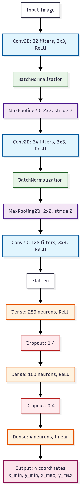
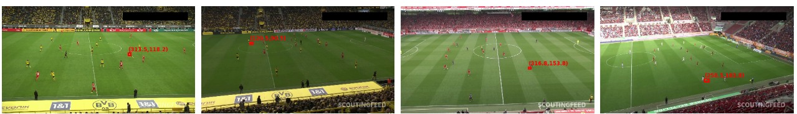
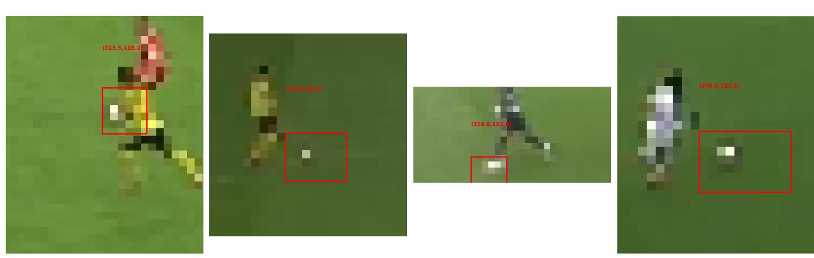

# Ball_detection
Machine Learning assignment.

# File structune
1. _train.py_ : File pertaining to training of the data.
2. _test.py_ : File pertaining to testing of data.
3. _visualizer.py_ : Contains the code for `matplotlib` visualizer.
4. _model.py_ : Contains the class which is a subclass of Keras's Model.
5. _image.py_ : Helper class to create an instance of Keras Dataset object to store a set of images.


| Note: The dataset and the trained model have not been included yet.

# Training
To train the model.

```
python train.py
```

# Testing
To test the model.

```
python test.py
```

# CNN Architecture


The MAE achieved usign the above architecture was 0.15.

# Samples

Below are some of the examples.




# Normalization and Preprocessing
The images are resized to 1920 // 4 and 1080 // 4 dimensions. The bounding boxes are adjusted accordingly. Also, both the images and the corresponding true y values have been normalized. 


# Custom loss function

I tried constructing a custom loss function to extend `Iou` loss function. Basically adding a value equal to the distance between the centres of the predicted and true ys. Since I normalized everything, I added a value 2 to the distance penalty. Since Iou lies between 0 and 1, also the distance lies between 0 and 1 (Needed the model to distinguish between penalty due to no overlap and overlap). Turns out there's something called `DIou` which does the similar but converges faster and is smoother.

# Problems faced
I did not check the trained models at the start with visual outputs. The MEA observed was > 1.5. I assumed the model was trained wrong. But it turned out it works perfectly fine and a standard loss function like L1 loss was enough for this task. I spent a lot of time figuring out the correct architecture. I vaguely documented some of the details. 


